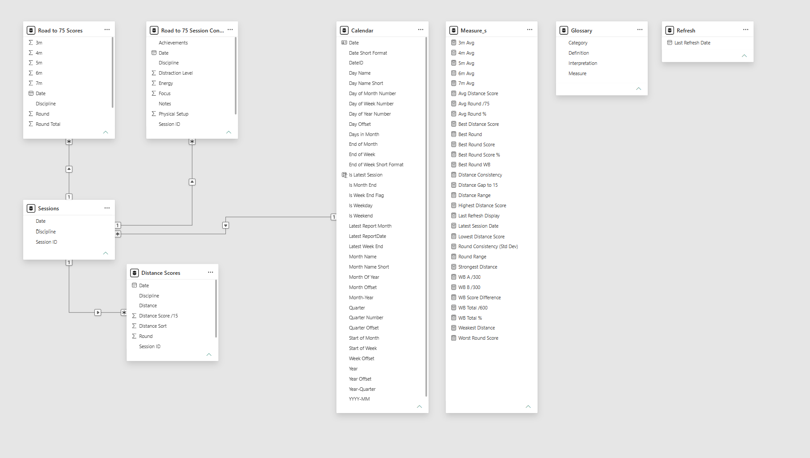
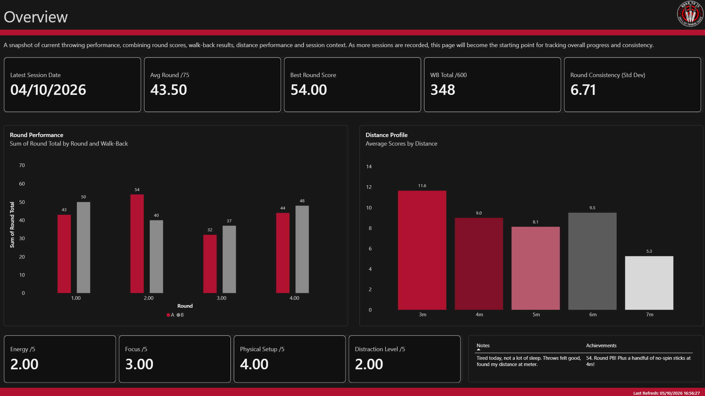

# Road to 75

**Throw. Track. Improve.**

Road to 75 is a personal performance analytics project built to track and improve my knife and axe throwing ahead of competition.

What began as a simple Excel-based score tracker has evolved into a more structured BI solution combining app-based data capture, Microsoft Lists, a Power BI semantic model, and a multi-page report suite designed to analyse scoring performance, consistency, distance trends, and session context.

The aim was not simply to record scores, but to create a repeatable way to understand where performance is improving, where weaknesses remain, and whether factors such as focus, energy, physical setup, and distraction appear to influence results.

I approached the project in the same way I would a professional BI solution: with clear structure, scalable data design, centralised measures, consistent definitions, documented metrics, and a report experience built around the questions the user needs to answer.

---

## The Problem

Raw throwing scores only tell part of the story.

I wanted to understand:

- how performance changes over time;
- which distances are strongest and weakest;
- how consistent scores are between rounds and walk-backs;
- whether the gap between stronger and weaker performances is narrowing;
- and whether session conditions appear to influence results.

That meant the solution needed to move beyond simple score storage and support repeatable analysis across multiple sessions and disciplines.

---

## How the Solution Evolved

The project has developed iteratively.

It started as a simple Excel tracker, then expanded into a more complete data product with:

- structured app-based data entry;
- Microsoft Lists as the backend;
- a reusable Power BI semantic model;
- a dedicated measures layer;
- session, round, distance, and context analysis;
- multiple throwing disciplines;
- and a broader reporting framework designed to scale as more data is recorded.

The solution now supports:

- Knife - Rotational
- Knife - No-Spin
- Axe

The design allows the reporting framework to expand without requiring a complete rebuild.

---

## Data Architecture and Model

*Semantic model — Star-style model centred on Sessions, with separate score, distance, context and calendar tables plus a dedicated measures layer.*

The Power BI model is centred around a **Sessions** table, with related tables for scored rounds, distance-level results, and session context.

A dedicated **Calendar** table supports time-based analysis.

A separate **Measure_s** table acts as a centralised measures layer, with measures grouped into display folders to improve maintainability and navigation within the model.

Helper tables are also used for:

- **Glossary** content, keeping metric definitions and interpretations visible;
- **Refresh** metadata, allowing report freshness to be displayed clearly.

This structure keeps analytical relationships focused while still supporting documentation and usability.

### Core model components

- `Sessions`
- `Road to 75 Scores`
- `Distance Scores`
- `Road to 75 Session Context`
- `Calendar`
- `Measure_s`
- `Glossary`
- `Refresh`

---

## Reporting and Analysis

The report is structured as a guided analytical journey.

### Overview

*Overview — Headline session KPIs, round performance, distance profile and contextual metrics.*

Provides a snapshot of current performance using headline KPIs such as:

- latest session date;
- average round score;
- best round score;
- total walk-back score;
- walk-back percentage;
- round consistency;
- round range.

It also includes round-level performance, average scores by distance, current session context, notes, and achievements.

### Distance Analysis

*Distance Analysis — Compares average scores, consistency and score gaps across 3m–7m.*

Breaks performance down across 3m-7m to identify strengths, weaknesses, consistency, and progression.

Measures and visuals include:

- average score by distance;
- distance consistency;
- gap to the maximum score of 15;
- highest and lowest distance scores;
- strongest and weakest distance;
- distance performance over time.

A consistent colour convention is used for 3m, 4m, 5m, 6m, and 7m so distances can be recognised quickly across visuals.

### Consistency & Progress

*Consistency & Progress — Tracks average round performance, ceiling/floor and walk-back consistency over time.*

Tracks whether performance is becoming more repeatable over time.

Analysis includes:

- average round progression;
- best and worst round scores;
- round consistency using standard deviation;
- round range;
- walk-back score gap.

The aim is to show not only whether scores are increasing, but whether stronger performances are becoming more consistent.

### Session Context

*Session Context — Explores how energy, focus, physical setup and distraction relate to performance.*

Explores whether session conditions appear to relate to throwing performance.

Tracked factors include:

- energy;
- focus;
- physical setup;
- distraction level;
- session notes;
- achievements.

As more sessions are recorded, this page provides a growing basis for comparing performance with the conditions surrounding each session.

### Raw Data

Provides detailed access to recorded throwing scores, session context, notes, and session reviews.

This page supports:

- validation;
- transparency;
- detailed review;
- deeper analysis.

### Glossary

Documents the measures used throughout the report.

Each measure includes:

- category;
- measure name;
- definition;
- interpretation.

This helps maintain consistency in how metrics are understood and supports trusted reporting.

---

## Key Measures

Examples of measures used in the solution include:

- Avg Round /75
- Avg Round %
- Best Round Score
- Best Round Score %
- Round Consistency (Std Dev)
- Round Range
- WB A /300
- WB B /300
- WB Total /600
- WB Total %
- WB Score Difference
- Avg Distance Score
- Distance Consistency
- Distance Gap to 15
- Highest Distance Score
- Lowest Distance Score
- Strongest Distance
- Weakest Distance
- Latest Session Date
- Last Refresh Display

---

## Design and Usability Decisions

The report uses a consistent visual design built around black, charcoal, white, and ruby tones.

Key UX choices include:

- consistent page structure;
- clear page titles and explanatory subtitles;
- centralised navigation;
- a consistent distance colour convention;
- dedicated slicer panels on analytical pages;
- visible refresh information;
- glossary documentation;
- consistent KPI card styling;
- support for both summary and detailed analysis.

The aim was to create a report that is visually distinctive while remaining clear, structured, and easy to navigate.

---

## What This Project Demonstrates

Road to 75 demonstrates:

- end-to-end BI thinking;
- structured data capture;
- semantic and dimensional modelling;
- DAX measure design;
- Power Query transformation;
- data visualisation and UX design;
- KPI and metric definition;
- data quality and validation;
- maintainable model organisation;
- reporting documentation;
- iterative solution development;
- scalable solution design;
- turning a personal use case into a structured analytical product.

---

## Technology

- Microsoft Power BI
- DAX
- Power Query
- Microsoft Lists
- App-based data entry
- Excel (original prototype / early-stage tracking)
- Git / GitHub
- VS Code

---

## Screenshots

Screenshots will be added here as the portfolio version is finalised.

Suggested screenshots:

1. Report cover
2. Overview
3. Distance Analysis
4. Consistency & Progress
5. Session Context
6. Data model
7. Glossary

---

## Future Development

Road to 75 will continue to evolve as more data is collected.

Planned or potential future development includes:

- expanding the dataset with more sessions and competitions;
- deeper analysis across multiple throwing disciplines;
- Python-based data preparation and analysis;
- further exploration of Microsoft Fabric;
- Git-based version control and project documentation;
- additional automation and data quality checks;
- responsible use of AI to support documentation, validation, and analytical workflows.

---

## Project Context

Road to 75 is a personal project built around my own knife and axe throwing data.

The subject matter is deliberately personal, but the approach is professional: define the problem, structure the data, build a maintainable model, create useful measures, design the reporting experience, validate the outputs, and iterate as the solution grows.

That process reflects how I like to work with data.

---

**Carl Hadi**  
Data Consultant | Power BI | Business Intelligence | SQL

*It's not work if you #LoveWhatYouDo*
